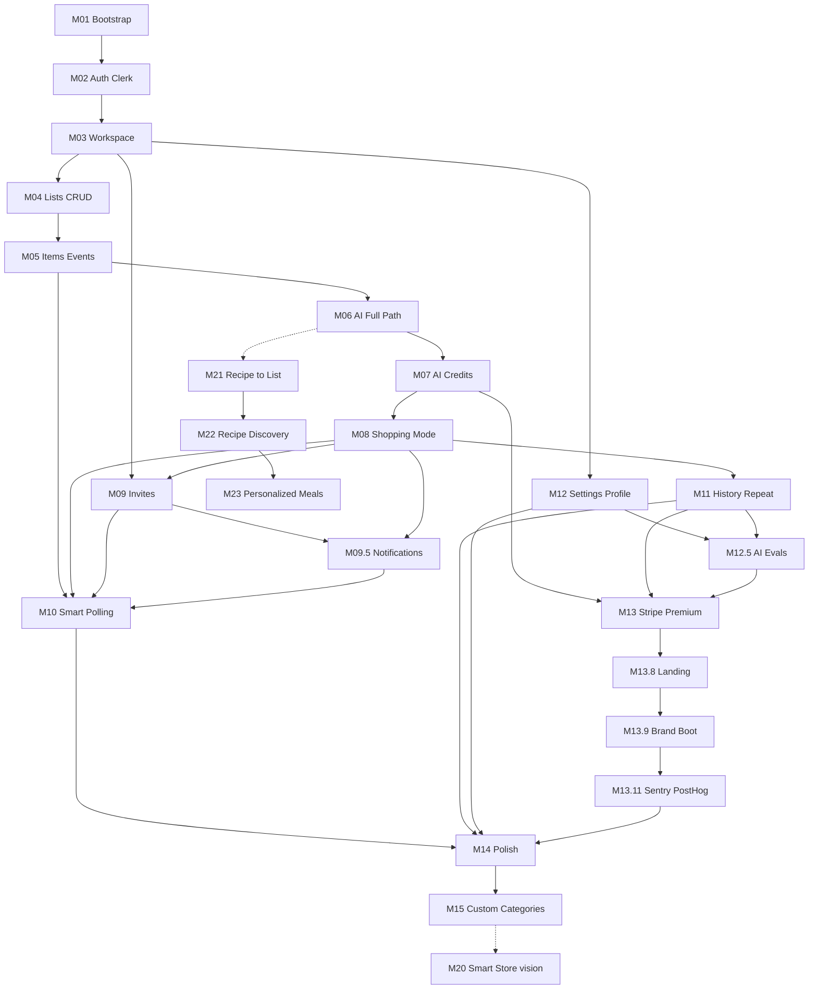
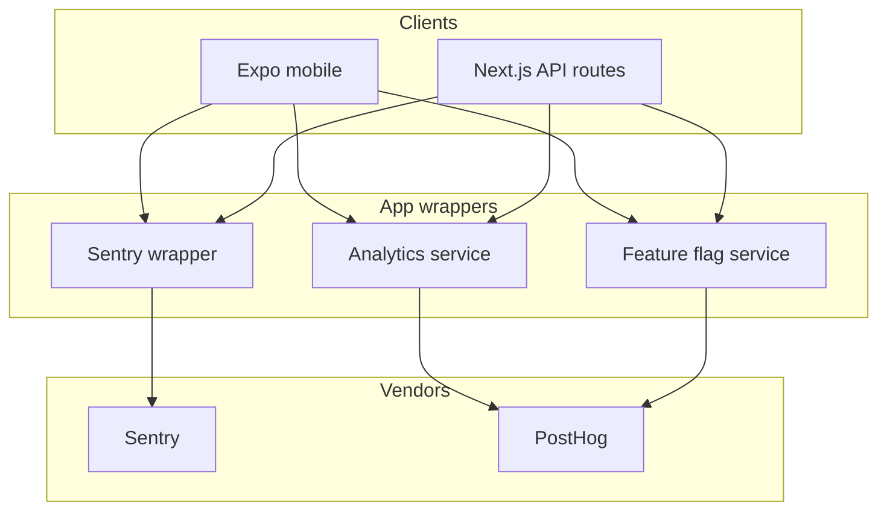
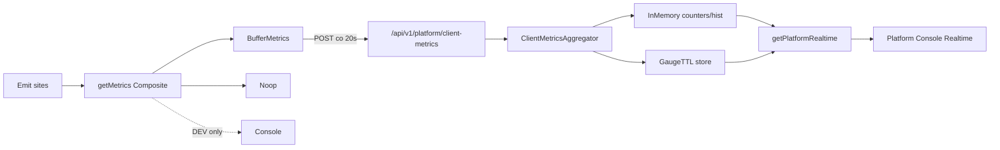
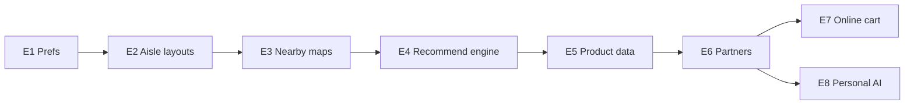
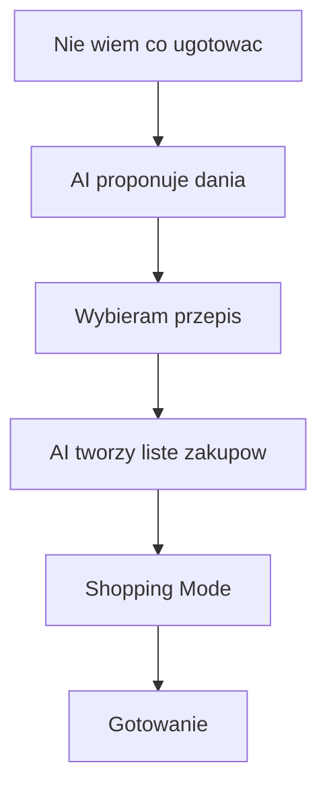
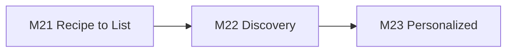

# Kangur - MVP Implementation Roadmap

**Status:** Living document - return here between milestones  
**Last updated:** 2026-07-22  
**Companions:** [prd.md](./prd.md) · [architecture.md](./architecture.md) · [cursor-rules.md](./cursor-rules.md) · [deploy.md](./deploy.md)

---

## Locked defaults

| Decision | Value |
|----------|--------|
| Repo layout | `mobile/` + `backend/` + `docs/` - **no `packages/`** |
| Database | **Neon** (serverless Postgres) + Prisma - **no Prisma Accelerate** |
| Free AI Credits | **30 / month** per workspace |
| AI Credit costs | Screenshot **2** · Text/Clipboard **1** |
| Invites | Email |
| Auth | Clerk: **email/password**, **Google**, **Apple** |
| AI Review | Always shown (compact when all high-confidence) |
| OpenAPI | **Generated from Zod only** - never hand-edit |
| Env setup | Complete `.env.example` from M01 (fresh clone in minutes) |

### OpenAPI (non-negotiable)

Spec is generated automatically from Zod (e.g. `@asteasolutions/zod-to-openapi` + build/CI script). Routes register Zod schemas; clients may consume the generated file. If the spec drifts, fix the **Zod source** - not the OpenAPI document.

### Product-first order (why)

```
Workspace → CRUD → AI (Import→Processing→Review→Apply) → Shopping Mode → Invites → Polling → …
```

Screenshot → AI → list is the product. Invites and polling support collaboration but do not define the wedge. Shopping Mode ships right after AI so the demo already works end-to-end.



### Cursor habit

One vertical slice per milestone; register new Zod schemas so OpenAPI regenerates in the same change; no Redux/MobX; keep docs to: `prd.md`, `architecture.md`, `cursor-rules.md`, `roadmap.md`, `deploy.md`.

### Milestone status

| ID | Milestone | Status |
|----|-----------|--------|
| M01 | Bootstrap | done |
| M02 | Auth (Clerk) | done |
| M03 | Workspace | done |
| M04 | Lists CRUD | done |
| M05 | Items + events | done |
| M06 | AI full path | done |
| M07 | AI Credits | done |
| M08 | Shopping Mode | done |
| M08.5 | Data Sync Engine | done |
| M09 | Invites | done |
| M09.5 | Notifications (MVP) | done |
| M10 | Smart polling | done |
| M11 | History + Repeat | done |
| M12 | Settings + Profile | done |
| M12.5 | AI Evaluation Framework | done |
| M13 | Stripe Premium (+ AI Generate from History) | done |
| M13.4 | App Menu + Platform Console shell | done |
| M13.5 | Observability foundation | done |
| M13.6 | Platform Console Realtime | done |
| M13.8 | Public landing + legal | done |
| M13.9 | Brand Boot Animation | done |
| M13.11 | Observability & Product Analytics | done |
| M14 | Polish + RC | pending |
| M15 | Custom categories (post-MVP) | pending |
| M13.7 | Client Metrics Ingestion | deferred (post-release) |
| M20 | Smart Store Ecosystem | vision (post-release) |
| M21 | Recipe → Shopping List | vision (post-release) |
| M22 | Recipe Discovery | vision (post-release) |
| M23 | Personalized Meal Discovery | vision (post-release) |

---

## M01 - Bootstrap (repo, apps, design tokens, i18n shell)

**Goal:** Runnable empty Expo + Next.js + Prisma + **Neon** + CI skeleton with design-system tokens, PL/EN wiring, and **complete `.env.example` files** (no product features yet).

**Creates:**
- `backend/package.json`, `backend/tsconfig.json`, `backend/next.config.ts`, `backend/app/layout.tsx`, `backend/app/api/health/route.ts`
- `backend/prisma/schema.prisma` (minimal stub + `DIRECT_URL` support if using Neon pooler), `backend/lib/prisma.ts`
- `backend/openapi/registry.ts`, `backend/scripts/generate-openapi.ts` (or npm script), generated `backend/openapi/openapi.json` (**gitignored or marked GENERATED - never hand-edited**)
- **`backend/.env.example`** - full variable set from day one (Neon `DATABASE_URL` / `DIRECT_URL`, Clerk, OpenAI, Stripe, `AI_FREE_MONTHLY_CREDITS=30`, `APP_URL`, …)
- **`mobile/.env.example`** - `EXPO_PUBLIC_CLERK_PUBLISHABLE_KEY`, `EXPO_PUBLIC_API_URL`
- `mobile/package.json`, Expo Router `mobile/app/_layout.tsx`, `mobile/app/(tabs)/_layout.tsx` + placeholder tab screens
- `mobile/design-system/tokens.ts`, `mobile/design-system/theme.ts`
- `mobile/lib/i18n/index.ts`, `mobile/lib/i18n/pl.json`, `mobile/lib/i18n/en.json`
- `mobile/lib/api/client.ts` (base URL only), `mobile/lib/query/client.tsx`
- Root `README.md` (setup: Neon project → copy env → migrate → run), `.gitignore`, optional `.github/workflows/ci.yml` (include `openapi:generate` check)
- Document Neon branching: production / preview / local (README)

**Depends on:** nothing  
**Complexity:** M  

**Acceptance:**
- [ ] `backend` starts; `GET /api/health` returns 200
- [ ] Expo app launches with 4 placeholder tabs
- [ ] Tokens + i18n switch PL/EN works on a demo string
- [ ] Prisma migrates successfully against **Neon** (pooled + direct URL pattern documented)
- [ ] **No Prisma Accelerate** in dependencies
- [ ] `pnpm openapi:generate` (or equivalent) produces OpenAPI from Zod registry only
- [ ] `.env.example` files list every expected secret/public var (including future Clerk/Stripe/OpenAI) so setup is copy-fill-run
---

## M02 - Authentication (Clerk)

**Goal:** Sign up / sign in via **email/password** and **Google**; Bearer JWT → `requireUser()` → `UserContext`; `GET /api/v1/me`.

**Status:** done (2026-07-16)  
**Deferred:** Apple Sign In (architecture-ready; implement before App Store path)

**Creates:**
- Prisma `User` (`clerkId`, `email`, nullable `locale`, timestamps)
- `backend/lib/auth/clerk.ts`, `requireUser.ts` → `UserContext`, `errors.ts`
- `backend/app/api/v1/me/route.ts` + OpenAPI from Zod
- `mobile` ClerkProvider + secure token cache, `(auth)` screens, route guards, `useMe()`, Profile sign out
- Env keys / Google redirect notes in `.env.example` + README (Apple deferred)

**Depends on:** M01  
**Complexity:** M  

**Acceptance:**
- [x] Email/password sign-up and sign-in (Clerk + mobile screens)
- [x] Google OAuth (mobile; Clerk Dashboard + `kangur://` redirect)
- [x] Apple Sign In **deferred** (not in M02)
- [x] `GET /api/v1/me` → 401 `{ code, message }` unauthenticated; 200 user DTO when valid; upsert + `updatedAt` touch; locale from device when null
- [x] Signed-out users redirected from tabs → auth; session restore via secure store
- [x] `requireUser` returns `UserContext`; single `useMe()`; auth `console.info` logs

---

## M03 - Workspace core (provision, avatar, switcher)

**Goal:** On first login, upsert `User` + default Home workspace; create/list/switch workspaces with icon id.

**Status:** done (2026-07-16)

**Creates (backend):**
- Prisma: `Workspace`, `WorkspaceMember` (`joinedAt`), `WorkspaceSettings`, optional `Subscription` (Premium only). **No AIUsage in M03.**
- `shared/workspace-icons.ts` - `{ id, emoji }[]` allowlist
- `backend/features/workspace/*`, `backend/lib/authorize.ts`
- `GET/POST /api/v1/workspaces`, `GET /api/v1/workspaces/:id` + OpenAPI from Zod

**Creates (mobile):**
- Switcher, create sheet, active workspace (AsyncStorage), Workspace tab wired to API

**Depends on:** M02  
**Complexity:** M  

**Acceptance:**
- [x] First login creates user + default Home (`icon: "home"`)
- [x] Create second workspace with custom icon; switcher updates active context
- [x] All workspace routes enforce membership (404)

---

## M04 - Shopping lists CRUD

**Goal:** Create/rename/list active lists in a workspace; open list screen (empty items OK).

**Status:** done (2026-07-16)

**Creates:**
- Prisma: `ShoppingList`
- `backend/features/shopping-list/*` + `/api/v1/workspaces/:id/lists` CRUD
- `mobile/features/shopping-list/home-lists-screen.tsx`, `list-screen.tsx` (shell)
- Home tab wired to active lists + create CTA

**Depends on:** M03  
**Complexity:** S–M  

**Acceptance:**
- [x] CRUD active lists scoped to workspace
- [x] Cross-workspace list IDs return 404/403
- [x] Home shows lists for active workspace only

---

## M05 - Shopping items CRUD + activity log writes

**Goal:** Manual add/edit/status; closed category enum; append `ShoppingEvent` on mutations (no polling yet). Baseline list so AI has something to merge into.

**Status:** done (2026-07-16)

**Creates:**
- Prisma: `ShoppingItem`, `ShoppingEvent`
- Zod: category enum, item DTOs
- `backend/features/shopping-item/*`, `backend/lib/events/appendShoppingEvent.ts`
- Routes under `/api/v1/lists/:listId/items`
- `mobile/features/shopping-item/manual-add-sheet.tsx`, item row (normal density)
- Register item/event Zod schemas → regenerate OpenAPI
- `GET .../events?after=` ready for later polling

**Depends on:** M04  
**Complexity:** M  

**Acceptance:**
- [x] Add/edit item; statuses pending/bought/unavailable/removed
- [x] Category only from closed enum
- [x] Each mutation creates a `ShoppingEvent` row
- [x] Events endpoint returns cursor-friendly results

---

## M06 - AI feature (Import → Processing → Review → Apply)

**Goal:** Ship the **entire killer path as one feature**. Solo user can go: import → AI → ready list.

**Status:** done (2026-07-16)

**Flow:**

```
Import (Screenshot | Text | Clipboard)
  → Processing
  → AI Review
  → Apply
  → List updated
```

**AI Review actions (required):**
- **Accept all** - primary CTA when safe
- **Accept individual** - per proposed item / merge
- **Reject individual** - drop one proposal row without leaving Review
- **Edit** - rename, qty, unit, category, note
- Reject-all / cancel abandon without apply (list unchanged)

**Creates (backend):**
- Prisma: `AiIngestRun`
- `backend/features/ai/schemas.ts` (Zod structured outputs)
- `backend/features/ai/ingestText.ts`, `ingestScreenshot.ts`, `applyAiProposal.ts`
- Routes: `POST .../ai/ingest`, `POST .../ai/apply`
- `backend/lib/openai.ts`
- Ephemeral screenshot handling (no durable storage)
- Register ingest/apply Zod → regenerate OpenAPI

**Creates (mobile):**
- `mobile/features/ai/import-chooser-screen.tsx`
- `mobile/features/ai/import-text-screen.tsx`, `import-screenshot-screen.tsx`, `clipboard-offer.tsx`
- `mobile/features/ai/processing-screen.tsx`
- `mobile/features/ai/ai-review-screen.tsx` (bulk + per-item accept/reject)
- Stack wiring from list → import → processing → review → back to list

**Depends on:** M05  
**Complexity:** L (2–3 Cursor sessions OK; still one milestone)

**Acceptance:**
- [x] Screenshot, text, and clipboard entry points work
- [x] Clipboard offer when returning with text (Android priority)
- [x] Ingest returns structured proposal only (never free-text parse)
- [x] Categories from closed enum; no invented quantities/brands in schema rules
- [x] Review shows low confidence, merges, unknown items
- [x] Accept all, accept individual, reject individual, and edit all work
- [x] Apply writes only accepted rows + events + raw JSONB; abandon before apply leaves list unchanged
- [x] Screenshots not persisted after the request

---

## M07 - AI Credits metering

**Goal:** Server-enforced AI Credits; Free cap; balance visible in UI.

**Cost table (MVP):**

| Action | AI Credits |
|--------|------------|
| Text import | 1 |
| Clipboard import | 1 |
| Screenshot import | 2 |

**Creates:**
- `backend/lib/aiCredits.ts` (`debitAiCredits`, period bucket, cost map above)
- Wire debit into successful **apply** (not failed validation / abandoned review)
- `GET .../ai-credits`
- `mobile/features/billing/ai-credits-badge.tsx` on Workspace tab
- Env `AI_FREE_MONTHLY_CREDITS=30`

**Depends on:** M06  
**Complexity:** S–M  

**Acceptance:**
- [x] Screenshot apply debits **2**; text/clipboard apply debits **1**
- [x] Exhausted Free balance blocks ingest; list CRUD still works
- [x] Product copy says “AI Credits”

---

## M08 - Shopping Mode + Finish Shopping + Summary

**Goal:** In-store UX + trip ending. Hard to leave by accident; easy to add one more item without exiting.

**Creates:**
- `mobile/features/shopping-list/shopping-mode-screen.tsx`
- `mobile/features/shopping-list/finish-summary-screen.tsx`
- `mobile/features/shopping-list/shopping-mode-exit-guard.ts` (back gesture / hardware back)
- `mobile/design-system/shopping-density.ts`
- Expo keep-awake integration
- **Floating Add Button** → manual add sheet without leaving Shopping Mode
- Backend archive / finish helpers as needed
- Swipe / huge checkboxes; Finish → counts → Archive

**Shopping Mode UX rules:**
- **Disable accidental back gesture** (iOS swipe-back / Android back) - or intercept it
- **Confirm exit** before leaving Shopping Mode (unless Finish Shopping flow)
- **Floating Add Button** - mid-shop add without exiting mode

**Depends on:** M05; best after M06 so demo is Import → Review → Shopping Mode  
**Complexity:** M  

**Acceptance:**
- [x] Start shopping enters Shopping Mode (large targets, minimal chrome)
- [x] Accidental back does not silently exit; user gets confirm exit
- [x] Floating Add Button opens manual add and returns to Shopping Mode
- [x] Optional keep-screen-on (default off until settings; hardcode toggle OK)
- [x] Finish shows Bought / Unavailable / Removed counts
- [x] Archive from summary removes list from Home active set

---

## M08.5 - Data Sync Engine + Shopping Session

**Goal:** Network is transport. UI stays instant. Engine reusable beyond shopping.

**Creates:**
- `mobile/features/data-sync-engine/` (façade: Queue, Worker, Persistence, Connectivity, Conflict stub)
- `mobile/features/shopping-list/session/` (Session SM; UI never mutates SessionState)
- `mobile/features/offline/OfflineStatusBanner.tsx`

**Acceptance:**
- [x] DataSyncEngine façade; modules independently testable
- [x] Events informational; no business logic on event order
- [x] Persistence meets durability (AsyncStorage; MMKV/SQLite swappable)
- [x] Time-sortable op ids; compress rules; single worker; 1s debounce; restart-safe flush
- [x] Session SM; Resume Continue/Discard; OfflineStatusBanner; Finish anyway local hide

---

## M09 - Members and email invitations

**Goal:** Multi-user workspace - after the product wedge exists.

**Creates:**
- Prisma: `Invitation` (tokenHash, pending|accepted|revoked)
- `backend/features/workspace/inviteMember.ts`, `acceptInvitation.ts`, `listInvitations.ts`, `revokeInvitation.ts`, `removeMember.ts`
- Routes: invitations CRUD, accept, member remove/role
- Mobile: invite section, pending list, member menus, `invite/[token]` accept flow

**Depends on:** M03; useful after M08 for two-person shopping demos
**Complexity:** M

**Acceptance:**
- [x] Owner/admin can invite by email; member cannot
- [x] Invitee accepts and sees workspace
- [x] Unauthorized role actions return 403

---

## M09.5 - Notifications (MVP)

**Goal:** Minimal production-ready notification architecture for workspace collaboration - push + in-app center + prefs - without spam.

**Creates:**
- Prisma: `Notification`, `UserNotificationPreferences`, `PushDevice`, `ShoppingSession`
- `backend/lib/events/DomainEventBus.ts` (`Promise.allSettled`)
- `NotificationHandler` → pure `NotificationRepository` → `NotificationCreatedEvent` → `PushHandler`
- `ShoppingSessionService` (start/finish: publish → archive → close)
- Routes: notifications list/read, prefs, push-devices, list sessions
- `mobile/features/notifications/` - center, bell badge, prefs, push registration

**Depends on:** M09 (invites), M08 / M08.5 (shopping session)
**Complexity:** M

**Acceptance:**
- [x] Home bell opens Notification Center; mint unread badge; groups Dzisiaj…Starsze; pull-to-refresh
- [x] Four MVP events via domain bus; repository has no side-effects; push via NotificationCreatedEvent
- [x] Prefs persisted; new shopping list default OFF
- [x] Taps: invite → accept; started → shop; finished → finish summary; list created → list
- [x] Navigation idempotent (no duplicate screens / sessions)
- [x] No per-item / AI / credits notifications

---

## M10 - Smart polling (`EventPollingProvider`)

**Goal:** Live collaboration once invites exist; transport-agnostic.

**Status:** done (2026-07-18)

**Creates:**
- `mobile/lib/realtime/EventPollingProvider.ts` - adaptive poll (3→5→10s), `pollNow`, drain cap
- `useListRealtime` + soft toast (presentation only) on list / Shopping Mode
- Cursor `{ lastEventId, lastUpdatedAt: event.createdAt }` in AsyncStorage
- `scheduleItemsRefresh` - debounced invalidate; defer while local sync pending

**Depends on:** M05 (events API), M09 (second user); Shopping Mode lifecycle from M08  
**Complexity:** M  

**Acceptance:**
- [x] Two members: A mutates, B updates within ~3s (hot interval) without pull-to-refresh
- [x] Polling stops on background / leave list; resumes with `pollNow` on foreground / online
- [x] No websocket vendor in domain code
- [x] Events never applied as list source of truth (invalidate → GET items)

---

## M11 - History + search + Repeat List

**Goal:** Past lists, search, duplicate as a new pending list.

**Status:** done (2026-07-19)

**Creates:**
- History tab UI + local search (single fetch, client-side filter)
- `GET /api/v1/workspaces/{id}/lists/history` (preview items, Free depth 20 / Premium cap 200)
- `POST /api/v1/lists/{id}/restore`, `POST /api/v1/lists/{id}/repeat`
- Free history depth guard → `403 HISTORY_LIMIT_EXCEEDED` (minimal body)
- Repeat: same title; all business item fields; navigate to new list; Restore secondary
- Analytics stubs: `history_opened` / `_search` / `_repeat` / `_repeat_completed` / `_restore`

**Depends on:** M08 (archive path)  
**Complexity:** S–M  

**Acceptance:**
- [x] History shows archived/past; search by title (local)
- [x] Repeat List creates new list with items reset to pending
- [x] Restore works
- [x] Free depth limit enforced (`HISTORY_LIMIT_EXCEEDED`)

---

## M12 - Workspace settings + Profile

**Goal:** Profile, locale, and notification preferences that users need day to day.

**Status:** done (2026-07-18)

**Shipped:**
- Profile tab - account details, login methods, change password, delete account, sign out
- Language toggle PL/EN (client i18n)
- Notification preferences screen (silent mode + per-type toggles; API-backed)
- Premium / plan affordances on profile (upsell stubs where billing not yet live)

**Deferred (not blocking M12):**
- Workspace settings: realtime sound / haptic, default shopping layout, keep-screen-on toggle UI, AI merge prefs - fold into M10 (sound/haptic with polling) or M14 if still needed
- Keep-awake in Shopping Mode remains hardcoded on for the trip (setting UI later)

**Depends on:** M03; notification prefs overlap M09.5  
**Complexity:** S–M  

**Acceptance:**
- [x] Profile tab: account, language, notifications, sign out
- [x] Profile switches PL/EN
- [x] Notification prefs persist via API
- [x] No settings sprawl beyond what shipped (+ deferred list above)

---

## M12.5 - AI Evaluation Framework

**Goal:** Offline harness for AI proposal quality (`backend/evals/`) so History Suggest (and later Import) can be regression-tested with real model calls before Premium monetization.

**Status:** done

**Creates:**
- `backend/evals/` - Scenario → Adapter → Evaluator → Judges → Report
- Suite `history-suggest` (~29 YAML scenarios, golden baselines, hard/soft/info judges)
- CLI: `pnpm eval:ai`, `pnpm eval:prune-reports`
- Dated reports with suite/scenario/prompt versions, `promptHash`, `resolvedModel`, seed, cost, flaky `--repeat`, compare-prompt

**Depends on:** M11 (History Suggest pipeline), M12  
**Blocks:** ideally harden prompts before M13 Premium gates  
**Complexity:** M

**Acceptance:**
- [x] `pnpm eval:ai --suite history-suggest` harness wired (needs `OPENAI_API_KEY` for model scenarios)
- [x] Thin adapter over prod `buildSuggestFromHistory` + enrich (no HTTP/credits/DB)
- [x] Hard FAIL → exit 1; soft = warnings; info = metrics only
- [x] Golden write guarded (hard PASS + `--force`/confirm)
- [x] Report includes repro command, corpus snapshot, cost aggregates

---

## M13 - Stripe Premium

**Goal:** Introduce Premium workspaces powered by Stripe and deliver the first Premium-exclusive AI capability: **AI Generate from History**.

**Status:** done

```
Stripe (billing)
    ↓
Premium Entitlements (workspace subscription active)
    ↓
AI Generate from History (first Premium feature)
```

**Key split:**
- **Stripe** = payment provider only (Checkout, Customer Portal, webhooks). Not part of the AI feature logic.
- **Premium Entitlements** = product gate on the workspace (active subscription).
- **AI Generate from History** = first feature unlocked by that entitlement. It is **not** “part of Stripe.”

**Premium-only ≠ Unlimited AI Credits.**  
AI Generate from History requires an **active Premium workspace** *and* still goes through the existing **AI Credits** path (which Premium makes unlimited). Free workspaces cannot run it even if they somehow had credits.

**Creates:**
- `backend/features/billing/*` - Checkout + Customer Portal + webhook → set Premium entitlement
- `mobile/features/billing/premium-screen.tsx`
- Subscription status unlocks Premium entitlements (unlimited AI Credits + Generate from History)
- **AI Generate from History** - generate a shopping list from recent shopping history:
  - Backend loads up to **5** latest archived lists (`updatedAt` DESC); **no user list picker**
  - Same shared AI path: proposal (`AiIngestRun`) → **AI Review** → Apply (not a separate AI stack)
  - Server enforces Premium before start; Free / expired → `403 PREMIUM_REQUIRED`
- Analytics stubs: `history_ai_generate_started` / `_reviewed` / `_applied` / `_cancelled`
- Register billing (+ generate-from-history) Zod schemas → regenerate OpenAPI

**Depends on:** M07, M03, **M11** (archived history)  
**Complexity:** L  
**Estimate:** 2–3 sessions  

**Acceptance:**
- [x] Owner/admin Checkout; webhook upgrades workspace entitlement
- [x] Premium skips Free AI Credit cap (unlimited credits)
- [x] Member cannot manage billing
- [x] Webhook signature verified
- [x] Active Premium → AI Generate from History works (auto ≤5 recent archived lists → Review → new list)
- [x] No Premium → backend returns **`403 PREMIUM_REQUIRED`** (backend is source of truth)
- [x] Expired / cancelled subscription also blocks with **`403 PREMIUM_REQUIRED`**
- [x] Distinct from **Repeat List** (deterministic copy; available on Free within history depth)

---

## M13.4 - App Navigation & Side Menu

**Goal:** Application-level navigation (App Menu) separate from Bottom Tabs; Platform Console shell + `platformRole` access. Prerequisite for M13.5 observability UI.

**Creates:**
- Declarative full-screen App Menu (Home tab stack, native push; Bottom Tabs stay visible) - config → visibility predicate → route
- Home hamburger opens Menu (not Workspace tab; not a left drawer)
- `User.platformRole` enum (`USER` | `ADMIN`) + `/me` + `requirePlatformAdmin`
- Platform Admin bootstrap via `PLATFORM_ADMIN_EMAILS` (one-way promote on upsert; never auto-demote)
- About screen (Version, Environment, API, Build, Commit)
- Platform Console route shell - Overview (Platform Status + metrics) → Business → Realtime → Scaling → Backend
- `GET /api/v1/platform/overview` (ADMIN only)

**Depends on:** M03, M12  
**Complexity:** S–M  
**Blocks:** - (M13.5 fills Overview metrics)

**Platform Admin Bootstrap:** `platformRole` defaults to `USER`. During upsert, if email ∈ `PLATFORM_ADMIN_EMAILS` and role ≠ `ADMIN`, promote to `ADMIN`. Never auto-demote from env changes. Demotion = explicit ops action. Env is per-environment config (not a DB seed).

**Acceptance:**
- [x] Tabs = workflows; Menu = application-level destinations
- [x] Menu hierarchy: Account / Workspace (1 shortcut) / Application / Platform
- [x] Platform section + Console only for `platformRole = ADMIN` (client hide + backend 403)
- [x] Platform Console read-only shell with Overview-first IA
- [x] About build identity fields
- [x] `PLATFORM_ADMIN_EMAILS` one-way promote on upsert (documented)
- [x] Architecture §4 + roadmap updated

---

## M13.5 - Observability & Scaling Foundation

**Goal:** Measure polling/sync/shopping health via a swappable Metrics facade; fill Platform Console Overview; inform WebSocket migration without shipping WebSockets.

**Status:** done (2026-07-19)

**Creates:**
- `shared/metrics/` - metric names, tags, provisional capacity constant  
- `mobile/lib/metrics/` - Noop / Console (DEV) / Composite; wired into EventPollingProvider, scheduleItemsRefresh, syncTelemetry  
- `backend/lib/metrics/` - Noop + InMemory (+ Console if `METRICS_DEBUG=1`), `withHttpMetrics`, Prisma query timing  
- Events + shopping session instrumentation; Platform Overview aggregates sessions + RPS/P95/headroom  
- Architecture §10.5 (SLOs, capacity, cost, dashboards, alerts, WS checklist)

**Depends on:** M10, M08.5, M08, M13.4  
**Complexity:** M  

**Acceptance:**
- [x] Metrics facade with Noop default; syncTelemetry routes through it  
- [x] Realtime poll/latency/empty/events/refresh metrics emitted  
- [x] Backend HTTP + events endpoint timing + session counters  
- [x] Presence KPI = open sessions (+ poll-derived RPS)  
- [x] Docs: SLOs, capacity (provisional), Scaling/WS decision notes  
- [x] No behaviour change to polling/sync algorithms  

**Out / Future:** WebSocket, full Prometheus/OTel prod exporters, tracing, heartbeats, k6 load-test playbook, `estimated_monthly_ws_cost`.

---

## M13.6 - Platform Console Realtime

**Goal:** Operational Realtime diagnostics in Platform Console - polling / events / refresh / sync - using existing M13.5 server metrics where possible; honest placeholders for client-only KPIs until ingest exists.

**Status:** done (2026-07-19)

**Creates:**
- `GET /api/v1/platform/realtime` (ADMIN) - P50/P95, empty-page ratio, events RPS, failures, sessions-as-pollers proxy  
- InMemory snapshot helpers: `p50`, `mean`, `zeroRatio`  
- Mobile Realtime panel: Polling / Events / Refresh / Sync sub-tabs, KPI cards + sparklines + interval distribution placeholder + system status  
- Console chrome: only **Overview** + **Realtime** visible; Scaling / Backend / Business deferred until data is valuable  
- Docs: phased Console growth order

**Depends on:** M13.5, M10  
**Complexity:** M  

**Acceptance:**
- [x] Realtime tab answers: is polling healthy? are events flowing? latency / empty ratio / failures visible  
- [x] No heavy chart libraries; lightweight sparklines + distribution bar  
- [x] Null / placeholder for Hot–Warm–Cold, refresh, sync, drain, pollNow (client metrics not ingested yet)  
- [x] Read-only; no polling/sync behaviour changes  

**Out / Future:** **M13.7** Client Metrics Ingestion (deferred post-release) for true poller gauges + interval tiers; Scaling / Backend / Business tabs; full Sync success-rate instrumentation.

---

## M13.8 - Public landing + legal

**Goal:** Minimalna strona publiczna przed release - krótki opis produktu, realne store CTAs, wymagane strony prawne + delete-account info pod Google Play / App Store; canonical metadata pod share/SEO.

**Hosting (locked):** Next.js `backend/` - route group `app/(marketing)/…`, ten sam deploy Vercel co API. Apex `https://getkangur.com`. **Bez** osobnego `landing/` ani `web/`.

**Creates/updates:**
- `backend/app/(marketing)/` - `/`, `/privacy`, `/terms`, `/contact`, `/delete-account`
- `/support` → redirect / alias to `/contact`
- Store buttons on `/`: Google Play (real URL via env/constant), App Store Coming Soon (disabled)
- Canonical metadata + favicon + OG image
- `robots.txt` + `sitemap.xml`
- `/site.webmanifest` with icons (**not** a full PWA)
- Public `not-found` with Kangur asset

**Routes:**

| Path | Behavior |
|------|----------|
| `/` | Short product blurb; store buttons (below) - no elaborate marketing landing |
| `/privacy` | Privacy policy |
| `/terms` | Terms of use |
| `/contact` | Contact |
| `/support` | Redirect / alias → `/contact` |
| `/delete-account` | How to delete account, what is deleted, support link (`/contact`) - instructions only, not self-service |

**Store buttons on `/` (not placeholders):**
- **Google Play** - active button with real URL (env / constant; swappable at launch without layout rebuild)
- **App Store** - visible **Coming Soon**, disabled (same layout, ready for a future URL)

**Depends on:** M13 (product ready to describe) - soft parallel OK if legal copy is ready  
**Blocks:** M14 RC / store submit (Play needs privacy URL + clear delete-account path)  
**Complexity:** S–M  
**Status:** done

**Acceptance:**
- [x] `/` on apex `getkangur.com` (prod) / Preview URL on PR - code ready; set `NEXT_PUBLIC_SITE_URL` on Vercel Production
- [x] `/privacy`, `/terms`, `/contact`, `/delete-account` available
- [x] `/support` → `/contact`
- [x] Google Play CTA = real link; App Store CTA = Coming Soon (disabled)
- [x] Canonical metadata + favicon + OG image configured
- [x] `robots.txt` + `sitemap.xml`
- [x] `/site.webmanifest` with icons (no PWA)
- [x] Public `not-found` with Kangur asset
- [x] Apex does not expose API (`/api/v1` only on `api.*`) - deploy topology in `docs/deploy.md`
- [x] PL copy minimum (EN nice-to-have in the same milestone if cheap)
- [x] privacy / terms / delete-account URLs ready for Google Play / Clerk / Stripe
- [x] All Google Play, Clerk, and Stripe links point at apex (`https://getkangur.com`), never `api.*` - documented; wire in dashboards at RC
- [x] Public inboxes: `contact@getkangur.com`, `support@getkangur.com` (`NEXT_PUBLIC_*_EMAIL`)

**Out of scope:** elaborate sales landing, blog, pricing tables, staging landing domain, separate web app, full self-service account deletion, PWA installability. Technical public endpoints (`/health`, `/metrics`, etc.) are **not** on apex - they stay on `api.*` only.

---

## M13.9 - Brand Boot Animation

**Goal:** Calm, premium cold-start experience (~850–1500 ms): white screen → one Splash Mascot lands → soft bounce → app content fades in under the mascot. Covers auth/home loading - **never invents waiting** beyond the min aesthetic window. Not a Premium/billing feature.

**Creates/updates:**
- `mobile/features/startup/AppStartupController.tsx` (+ hook/context) - cold-start-only orchestration; future home for onboarding / maintenance / force-update gates
- `mobile/components/BrandedBootSplash.tsx` - Reanimated mascot (lift, cubic-out enter, spring bounce, decorative shadow)
- Native Expo splash → white `#FFFFFF` handoff ([mobile/app.config.ts](../mobile/app.config.ts))
- Single splash mascot asset (fixed visual size ~42–48% width with min/max clamp); Premium / error / empty keep their own mascots elsewhere
- Home/auth reveal: **opacity only** (no BlurView, no translateY on content)
- After hard cap: existing **HomeSkeleton** (final page layout) → real content - never blank white, never full-screen layout swap after splash

**Design locks:**
- Cold start / process kill only - never on in-app navigation (Home ↔ Settings)
- Min **850 ms**, max **1500 ms**
- Splash ignores SafeArea - mascot optically centered on the physical screen
- Shadow is decorative only - never affects layout; animated independently
- Boot animation must never delay navigation that is already ready - purpose is to **cover loading**, not create waiting

**Depends on:** App shell (M02+); soft parallel with M13.8  
**Blocks:** M14 RC polish (boot = this milestone)  
**Complexity:** S  

**Acceptance:**
- [x] Cold start signed-in / signed-out shows branded boot then content
- [x] Warm navigation does not re-show splash
- [x] Timing within 850–1500 ms; fast boot still respects min window; slow boot hits cap then skeleton
- [x] One consistent Splash Mascot; sensible size on phone and tablet
- [x] No BlurView / expo-blur in this flow
- [x] Skeleton uses final Home chrome - no layout jump after splash

**Out of scope:** asset rotation, bag-only animation, Lottie/Rive, splash copy/tagline, dark mode

---

## M13.11 - Observability & Product Analytics

**Status:** done (code + docs; staging key verify remains for Closed Testing)

**Goal:** Production-ready **error monitoring**, **product analytics**, and **feature flags** before the first public release — using **Sentry** + **PostHog** only. No vanity analytics (button clicks, screen views, scroll). Privacy-first: business events and crashes, not list contents.

**Guiding principle:** Observability helps product decisions and production diagnosis — not maximal data collection. Every new event needs a clear business or technical purpose.

**Relation to M13.5 / M13.7:**
- **M13.5** = internal Metrics facade (ops / Platform Console) — keep as-is
- **M13.7** = client metrics ingest to Platform Console — **post-release**, separate
- **M13.11** = vendor crash + product funnels + rollout flags for store/Closed Testing

**Explicitly out of MVP:** Mixpanel, Amplitude, Firebase Analytics, OpenTelemetry, Prometheus, Grafana, data lake, custom event bus, Session Replay, autocapture, vanity events, routing PostHog through `Metrics.*`.

**Non-goals:** BI platform, data warehouse, UX heatmaps/scroll/session replay, infra monitoring (CPU/RAM/K8s), replacing app logs, collecting telemetry “just in case”.

**Depends on:** M13 (Premium events), M13.5 (env / About build identity), M13.9 (release labeling)  
**Blocks:** M14 RC / Closed Testing “wire PostHog + Sentry” ([deploy.md](./deploy.md) §6.8)  
**Complexity:** L  
**Estimate:** 2–3 sessions



### Locked product decisions

| Topic | Decision |
|--------|----------|
| Vendors | **Sentry** (errors + Release Health) + **PostHog** (product events + feature flags) |
| Event names | **snake_case**, past tense (`shopping_started`); **no** `mobile_`/`backend_` prefixes |
| Flag names | **snake_case**, positive capability; **no** `enable_` / `new_` / `flag_` |
| PostHog project | One project; property `environment` on every event |
| `schemaVersion` | Auto-merged in `Analytics.track` (`ANALYTICS_SCHEMA_VERSION = 1`) |
| `first_*` | Once per **user** (AsyncStorage gate) |
| Premium activate | **Backend only** (Stripe webhook) |
| Sentry | Errors-only + Release Health; `tracesSampleRate ≈ 0` |
| Sampling (prod) | 100% crashes/fatals; **~20%** handled |
| Groups | `group('workspace', id)` + workspace properties |
| identify | **Merge** person properties only — never full replace |
| Call sites | **Only** `Analytics.track` / `identify` / `group` / `reset` — never raw `posthog.capture` |
| Types | `track(EventName, Props)` — compile error on wrong props |
| `requestId` | One **logical operation** (e.g. AI Import→Apply); next Import = new id |
| Offline | PostHog RN SDK queue (no custom queue); backend fire-and-forget |
| AI cost | `estimated_cost_usd` only (USD) |
| Source maps EAS | Warn-only |
| Dev without keys | Noop |
| Analytics style | Business / funnel events only — **no** `button_clicked` / `screen_viewed` / scroll |
| Session Replay | **Off for MVP** (see below) |
| Metrics facade | Unchanged; do **not** route PostHog through `Metrics.*` |
| Env kill switches | Keep `featureGates.ts` env overrides as **hard kill** above PostHog flags |
| Flag resolution | DEV override → env hard kill → PostHog → safe default |
| PII in events | Opaque `userId` + `workspaceId` only; **no** email, names, list/item text, AI payloads |

### Session Replay (decision)

**Do not enable Session Replay for MVP / first public release.**

| Reason | Detail |
|--------|--------|
| Privacy | Even with masking, shopping UX is high-risk for product names / notes leaking |
| Need | Sentry + funnel events answer Closed Testing questions without replay |
| Perf | Extra mobile cost on mid-range devices during Shopping Mode |
| Later | Optional **staging / internal cohort only** after privacy review; never default-on for prod |

---

### 1. Sentry

#### Architecture

| Surface | SDK | Init |
|---------|-----|------|
| Mobile | `@sentry/react-native` (+ Expo config plugin) | Early in root layout / AppStartup; wrap navigation |
| Backend / API | `@sentry/nextjs` | `instrumentation.ts` + `sentry.server.config` / edge as needed |
| AI / Sync / Realtime | Same SDKs — capture at boundary with tags (`domain=ai\|sync\|realtime\|api`) | |

**Global Error Boundary (mobile):** custom boundary wrapping Expo Router that reports to Sentry then shows existing friendly UI (extend beyond bare `export { ErrorBoundary } from "expo-router"`).

#### Environments & release tracking

| Field | Source |
|-------|--------|
| `environment` | Map `EXPO_PUBLIC_APP_ENV` / Vercel: `development` → `development`, `preview` → `staging`, `production` → `production` |
| `release` | `{{version}} ({{build}})` — same as About / [deploy.md](./deploy.md) §8 |
| `dist` / commit | EAS `gitCommitHash` / Vercel `VERCEL_GIT_COMMIT_SHA` |
| Source maps | EAS upload on Android/iOS release; Next.js Sentry build plugin on Vercel |

#### What to report

| Category | Capture? | Notes |
|----------|----------|-------|
| Crash / unhandled JS | Yes | Default |
| Native exception | Yes | RN SDK |
| API errors | Yes (5xx + unexpected 4xx codes) | Tag `route`, `status`, `code`; **no** response body with list items |
| AI errors | Yes | `domain=ai`, stage `ingest\|apply\|suggest`; **no** prompt/proposal JSON |
| Sync errors | Yes | `domain=sync`, op type / failure class; **no** item payloads |
| Network errors | Yes | Timeout / offline as breadcrumbs + sampled exceptions |
| Performance | Light | API transaction / AI duration optional; Shopping Mode spans **off** until needed |

#### Context (privacy-safe)

| Context | Include | Exclude |
|---------|---------|---------|
| User | `id` = Clerk user id | email, name, phone |
| Tags | `environment`, `app_env`, `workspaceId`, `platform` (ios/android/web), `domain` | product names |
| Breadcrumbs | navigation route names, API method+path template, sync phase | query strings with secrets, request/response bodies |
| Extra | error `code` from API (`PREMIUM_REQUIRED`, …) | raw OpenAI / Stripe payloads |

**Dev:** Sentry **off** by default (or sample rate 0) unless `SENTRY_DEV=1`.  
**Staging + production:** on; production sample rates tunable.

---

### 2. PostHog — Product Analytics

#### Architecture

```
Call site → analytics.track(EventName, props)
                ↓
         Analytics service (mobile / backend)
                ↓
         PostHog SDK (or no-op in development)
```

- **Single event catalogue** in shared (or mirrored const) — TypeScript union + props Zod/types
- Wire existing stubs: `historyTelemetry.ts`, `historyAiAnalytics.ts`
- Identify: `posthog.identify(clerkUserId)` after auth; `group('workspace', workspaceId)` when active workspace known
- **Never** auto-capture clicks/pages

#### Event catalogue (MVP)

**Activation**

| Event | When | Props (safe) |
|-------|------|----------------|
| `account_created` | First successful upsert / first session after sign-up | `auth_provider` |
| `workspace_created` | Workspace created | `is_default_home` |
| `first_list_created` | First list in workspace (once per user or workspace — pick one, document) | `workspace_id` |
| `first_shopping_session` | First Shopping Mode start | `workspace_id` |
| `first_ai_import` | First successful AI apply | `source` (`screenshot`\|`text`\|`clipboard`) |

**Shopping**

| Event | When |
|-------|------|
| `shopping_started` | Enter Shopping Mode |
| `shopping_finished` | Finish → Summary / archive path |
| `shopping_cancelled` | Confirmed exit without finish |

Props: `list_id` (opaque uuid), `item_count` (number only), `duration_sec` optional — **no** titles/categories text.

**AI**

| Event | When |
|-------|------|
| `ai_import_started` | Ingest kicked off |
| `ai_import_edited` | User changed ≥1 Review row before apply |
| `ai_import_accepted` | Apply with ≥1 accepted item |
| `ai_import_rejected` | Abandon / reject-all / cancel before apply |
| `ai_import_failed` | Ingest/apply hard failure (mobile and/or backend 5xx) |
| `ai_model_completed` | Backend model call finished (cost props only) |
| `history_ai_generate_started` / `_reviewed` / `_applied` / `_cancelled` | Existing stubs (M13) |

Props: `source`, `credit_cost`, `proposal_item_count`, `request_id`, `edited_count`, `estimated_cost_usd` — **never** proposal text.

**Collaboration**

| Event | When |
|-------|------|
| `invitation_sent` | Invite created |
| `invitation_accepted` | Invite accepted |

**Premium**

| Event | When |
|-------|------|
| `paywall_viewed` | Premium screen / upgrade banner focus |
| `checkout_started` | Stripe Checkout session created |
| `subscription_activated` | Webhook → entitlement active (prefer **backend** emit) |
| `subscription_cancelled` / `subscription_expired` | Webhook (optional MVP+) |

**History (wire stubs)**

`history_opened`, `history_search` (boolean `had_query` only — **not** query string), `history_repeat`, `history_repeat_completed`, `history_restore`

**Future placeholders (define names now, emit later)**

| Event | Milestone |
|-------|-----------|
| `recipe_discovery_opened` / `recipe_card_liked` / `recipe_card_rejected` | M22 |
| `recipe_to_list_accepted` | M21 |
| `store_recommendation_shown` / `store_recommendation_selected` | M20 |

---

### 3. Feature Flags (PostHog)

#### Architecture

```
featureGates.isXEnabled(ctx)
        ↓
  1. Local DEV override (mobile only)
  2. Env hard kill (existing HISTORY_SUGGESTIONS_ENABLED etc.) → force off
  3. Else PostHog flag / multivariate
  4. Else safe default (usually off for new surfaces, on for shipped)
```

| Layer | Path |
|-------|------|
| Mobile | `mobile/lib/featureFlags.ts` + keep `featureGates.ts` as façade |
| Backend | `backend/lib/featureFlags.ts` + existing `featureGates.ts` |
| Names | `history_suggestions`, `recipe_discovery`, `shopping_v2`, `premium_paywall`, `apple_sign_in` |

#### Rollout strategy

| Scenario | Approach |
|----------|----------|
| New screen / AI surface | Flag default off → 10% → 50% → 100%; env kill remains |
| Premium-related UX | Flag + entitlement check (flag never bypasses Stripe SoT) |
| Emergency | Env `*=false` kills without PostHog dashboard access |

Flags are **part of app architecture** — new risky UI must be behind a named flag from day one.

---

### 4. Funnel Analytics

| Funnel | Steps | Product decision |
|--------|-------|------------------|
| Activation | `account_created` → `workspace_created` → `first_list_created` → `first_shopping_session` | Where new users drop before core value |
| AI Import | `ai_import_started` → `ai_import_accepted` \| `rejected` \| `failed` | Import quality vs friction in Review |
| Premium | `paywall_viewed` → `checkout_started` → `subscription_activated` | Paywall copy / Checkout drop-off |
| Invites | `invitation_sent` → `invitation_accepted` | Invite channel / accept UX |

Dashboards live in PostHog; no custom warehouse in MVP.

---

### 5. Privacy rules

**Never send:**
- Product / item names, notes, quantities text
- List titles (use opaque ids only)
- AI prompts, screenshots, proposal JSON, model raw output
- Email, display name, phone, address
- Exact search query strings
- Auth tokens, Stripe customer PII beyond opaque ids

**Allowed identifiers:** Clerk `userId`, `workspaceId`, `listId` (uuid), device/OS from Sentry defaults, `environment`, app version/build.

**Legal:** Align Privacy Policy (`M13.8`) copy with Sentry + PostHog processors before Closed Testing.

---

### 6. File structure (Creates)

```
shared/analytics/
  events.ts          # EventName + EventPropsMap + ANALYTICS_SCHEMA_VERSION
  ownership.ts       # EVENT_OWNERSHIP matrix (required before new events)
  domains.ts         # ErrorDomain + ErrorSeverity
  flags.ts           # FeatureFlags name constants
  index.ts

mobile/lib/analytics/
  index.ts           # track / identify / group / reset
  posthog.ts         # SDK wiring + no-op
  once.ts            # first_* once-per-user
  requestId.ts       # logical-op request ids
mobile/lib/sentry/
  init.ts
  ErrorBoundary.tsx
mobile/lib/featureFlags.ts

backend/lib/analytics/
  index.ts
  posthog.ts
  aiCost.ts          # estimated_cost_usd helper
backend/lib/sentry/
backend/lib/featureFlags.ts
backend/instrumentation.ts

# Wire stubs:
mobile/features/history/historyTelemetry.ts
backend/features/ai/historyAiAnalytics.ts
```

**Event ownership (happy path — no dual emit):** see `shared/analytics/ownership.ts`. Backend owns `account_created`, `workspace_created`, invitations, History AI, Premium subscription webhooks. Mobile owns shopping, AI import UX, paywall/checkout, `first_*`, History UI.

Docs touch: [architecture.md](./architecture.md) §10.5 addendum; [deploy.md](./deploy.md) §6.8 expand event table to match catalogue above.

---

### 7. Environment matrix

| | development | staging (`preview`) | production |
|--|-------------|---------------------|------------|
| PostHog events | Off or separate project | On | On |
| Sentry | Off unless `SENTRY_DEV=1` | On | On |
| Feature flags | Local defaults / optional PostHog | PostHog | PostHog |
| Session Replay | Off | Off | Off |
| Auto-capture | Off | Off | Off |

---

### 8. ENV variables (new)

**Mobile (EAS / `.env.example`):**
- `EXPO_PUBLIC_SENTRY_DSN`
- `EXPO_PUBLIC_POSTHOG_KEY` / `EXPO_PUBLIC_POSTHOG_HOST`
- `EXPO_PUBLIC_SENTRY_SEND_DEFAULT_PII=0` (explicit)

**Backend (Vercel / `.env.example`):**
- `SENTRY_DSN` (+ auth token for source maps in CI if used)
- `POSTHOG_KEY` / `POSTHOG_HOST` (server-side premium/webhook events)
- Optional: `SENTRY_DEV`, `ANALYTICS_ENABLED`

**CI / EAS / Vercel:**
- EAS: inject DSN/keys per profile; upload RN source maps on release builds
- Vercel: Sentry build plugin + env per Preview/Production
- Do not fail builds if analytics keys missing in local DIY clones — soft-disable

---

### 9. Impact surface

| Area | Impact |
|------|--------|
| Mobile | Root init, ErrorBoundary, telemetry call sites, EAS secrets, slightly larger binary |
| Backend | Sentry instrumentation, webhook → `subscription_activated`, AI/billing track helpers |
| CI/CD | Optional Sentry release create; no change to OpenAPI generate |
| Platform Console | Unchanged (still M13.5 Metrics) |
| M13.7 | Still deferred; not blocked by M13.11 |

---

### Implementation order

1. Shared event catalogue + no-op Analytics / Flag façades  
2. Sentry mobile + backend (env, release, ErrorBoundary)  
3. PostHog mobile identify + core activation/shopping/AI events  
4. Backend Premium webhook + AI history stub wiring  
5. Feature flag service + migrate one gate (e.g. history suggestions) as pattern  
6. Staging verify → enable production keys for Closed Testing  
7. Update Privacy / deploy docs  

---

### Acceptance

- [x] Typed `Analytics.track(EventName, Props)` + `schemaVersion` on every event; ownership matrix in `shared/analytics/ownership.ts`
- [x] No raw `posthog.capture` call sites — wrappers only; noop without keys
- [x] Sentry mobile ErrorBoundary + init (Release Health, sampling, domain/severity/requestId tags)
- [x] Backend Sentry via `instrumentation.ts`; PostHog webhook Premium + AI cost (`estimated_cost_usd`)
- [x] Core catalogue wired: activation, shopping, AI import (+ `ai_import_edited`), invites, paywall/checkout, history stubs
- [x] Feature flags: DEV override → env kill → PostHog → default; `history_suggestions` via `featureGates`
- [x] identify merge + workspace `group`; `requestId` scoped to one AI import op
- [x] `.env.example` + roadmap/deploy/architecture docs updated
- [x] Session Replay disabled; guiding principle / non-goals documented
- [ ] Staging live verify: Sentry crash + PostHog funnel with real keys (Closed Testing keys in EAS/Vercel)
- [ ] Privacy Policy mentions Sentry + PostHog processors (M13.8 copy pass)

### Definition of Done

- All events go only through Analytics wrappers
- Sentry reports errors when DSN configured (staging/production)
- PostHog collects only the defined catalogue
- Risky features can use Feature Flags (pattern + DEV override + env kill)
- App runs correctly without analytics keys (noop)
- architecture / roadmap / deploy docs updated

### Out of scope

- Full product heatmaps / session replay  
- OTel / Prometheus exporters (still future with M13.7+)  
- Replacing M13.5 Metrics / Platform Console  
- Implementing M20/M21–M23 events (names reserved only)
- Mixpanel / Amplitude / Firebase Analytics / custom data lake

### Locked answers (formerly open questions)

1. **PostHog:** one project + `environment` property  
2. **`first_*`:** once per **user**  
3. **Premium:** webhook-only `subscription_activated`  
4. **Sentry:** errors-only + Release Health; traces ≈ 0  
5. **EU:** default hosts `eu.i.posthog.com` (override via env)  
6. **Flags:** env kill remains; PostHog optional overlay  
7. **Groups:** workspace group enabled in MVP  
8. **Source maps:** warn-only on EAS

---

## M14 - Polish + release candidate

**Goal:** Design-system consistency, motion, mascot empty states, a11y, EAS smoke build. **Light mode only** - no dark theme. **Brand boot animation = M13.9** (do not re-scope splash here).

**Creates/updates:**
- Token / visual polish pass (light)
- 2–3 motions (enter, status, toast) - excluding boot splash
- Empty states (kangaroo / warm orange)
- Category labels PL/EN complete
- `mobile/eas.json` (already present - verify preview/prod profiles)
- Final sweep against PRD MVP acceptance
- Optional: remaining deferred settings from M12 (keep-screen-on UI, shopping layout)

**Depends on:** M06–M13 substantially complete; **M13.8** (privacy + delete-account URLs before RC / store); **M13.9** (brand boot); **M13.11** (Sentry + PostHog for Closed Testing)  
**Complexity:** M  

**Acceptance:**
- [ ] PL/EN parity on user-facing strings
- [ ] Shopping Mode one-handed verified
- [ ] PRD MVP checklist mostly green
- [ ] Dev/preview EAS build succeeds
- [ ] No dark-mode theme or dual-scheme polish required
- [ ] M13.8 live (privacy + delete-account URLs usable in Play / Clerk / Stripe)
- [x] M13.9 brand boot accepted on cold start
- [ ] M13.11 Sentry + PostHog live on staging (Closed Testing)
---

## M15 - Custom category packs (post-MVP)

**Goal:** Allow configuring category sets beyond grocery defaults so Kangur works for other list types - e.g. hardware / building store, plumbing, fishing tackle, or any custom pack. Same shopping-list UX (aisles as categories), different taxonomy.

**Creates/updates:**
- Category pack model (workspace- or list-scoped presets: grocery default + user-defined)
- CRUD UI to name packs and define categories (label, order, optional icon/color)
- List creation / settings: pick which pack applies
- AI ingest / categorization uses the active pack instead of hard-coded grocery categories
- Shopping Mode progress / badges respect custom categories
- PL/EN for pack UI; pack category labels as user content

**Depends on:** M14 (MVP complete); builds on M04–M06 category plumbing  
**Complexity:** L  
**Status:** post-MVP

**Acceptance:**
- [ ] User can create a custom pack (e.g. “Sklep budowlany”) with ordered categories
- [ ] List can use grocery default or a custom pack
- [ ] Items and AI assign categories from the active pack only
- [ ] Shopping Mode and filters work with custom categories
- [ ] Existing grocery lists unchanged when packs ship

---

## Phase 2 - Platform Evolution (Post-Release)

Milestones below are **intentionally deferred** until after the first production release. Pre-release priority is user-facing product and monetization (Stripe, billing, entitlements, RC, Play Store). Platform Console remains operational for MVP on server/proxy metrics.

---

## M13.7 - Client Metrics Ingestion

**Status:** Deferred until post-release (Planned - Phase 2 / Platform Evolution)

> M13.7 is intentionally deferred until after the first production release.  
> Platform Console is operational for MVP using existing proxy/server metrics.  
> Client metrics ingestion improves observability only and does not affect end-user functionality.

**Goal:** Ożywić placeholdery Realtime - klient już emituje metryki (`EventPollingProvider`, `scheduleItemsRefresh`, `syncTelemetry`), ale w prod trafiają do **Noop**. M13.7 dodaje ścieżkę buffer → batch POST → agregacja in-process → `GET /platform/realtime`.

**Bez zmian** w istniejących call sites `Metrics.*` - tylko nowy sink + wiring + API + mapowanie w `getRealtime`.



### Decyzje (ustalone)

| Temat | Decyzja |
|--------|---------|
| Kto POSTuje | Każdy zalogowany klient (`requireUser`), nie tylko ADMIN |
| Kiedy włączone | Prod + DEV - Buffer zawsze w Composite; Console nadal tylko DEV |
| Interval | **20 s** (w oknie 15–30 s), + flush przy `AppState` → `background` |
| Identyfikacja | Anonimowy `clientInstanceId` (UUID w AsyncStorage) - do sumowania gauge’y |
| Tagi | Nadal ignorowane w store (jak dziś); tiers już mają osobne nazwy metryk |
| Bezpieczeństwo | Allowlista nazw `realtime.*` / `sync.*` z `shared/metrics/names.ts`; limity rozmiaru body; fire-and-forget (błąd sieci nie wpływa na app) |
| Proxy vs client | Gdy są dane klienta dla danej KPI - **preferuj klienta**; inaczej zostaw obecny proxy serwerowy |

**Nadal null po M13.7** (brak emitów dziś): `timeoutsPerSec`, `lastError*`, `avgDelayMs`, `sync.successRate` - bez sztucznego wypełniania; ewentualna instrumentacja w osobnym follow-upie.

### Creates

**Shared - kontrakt batcha** (`shared/metrics/client-batch.ts` lub Zod + shared type):

- `clientInstanceId: string` (uuid)
- `sentAt: number` (epoch ms)
- `counters: Record<string, number>` - **delty** od ostatniego udanego flusha
- `gauges: Record<string, number>` - ostatnia znana wartość
- `histograms: Record<string, number[]>` - próbki od ostatniego flusha (cap per name, np. 40)
- Helper `isIngestibleMetricName(name)` - allowlista z `MetricNames` (tylko realtime + sync)

**Mobile - Buffer + flush** (`mobile/lib/metrics/`):

- `buffer.ts` - implementacja `Metrics`; `drain(): ClientMetricsBatch | null`
- `flusher.ts` - timer 20 s + `AppState`; `apiFetch POST /api/v1/platform/client-metrics`; clear delty dopiero po 2xx
- `client-id.ts` - `getOrCreateClientInstanceId()` via AsyncStorage
- Composite: `[buffer, Noop]` (+ Console w DEV); `startMetricsFlusher` / `stopMetricsFlusher` przy login/logout
- Emit sites **bez zmian**; lokalny cap ~200 pending hist samples

**Backend - ingest + GaugeTTL:**

- `POST /api/v1/platform/client-metrics` - `requireUser`, Zod limits, OpenAPI, **204**
- `applyClientMetricsBatch`: counters/hist → InMemory; gauges multi-client (`realtime.active_pollers`, `sync.queue_length`, `sync.failed_ops`) → GaugeTTL map (TTL **90 s**) + `sumGauge(name)`

**Realtime API mapping** (`getRealtime.ts`) - prefer client when present:

| KPI | Źródło po M13.7 |
|-----|-----------------|
| `activePollers` | `sumGauge(realtime.active_pollers)` jeśli klienci w TTL, else proxy sessions |
| `pollRequestsPerSec` | `rps(realtime.poll.requests)` jeśli >0, else events/http proxy |
| `p50/p95` | `realtime.poll.latency_ms` jeśli hist, else events/http duration |
| `emptyPollRatio` | `empty / (empty+with_events)` z counters, else `zeroRatio(page_size)` |
| `failuresPerSec` | `rps(realtime.poll.failures)` jeśli ticks, else `http.errors` |
| `intervalDistribution` | shares z counters hot/warm/cold → `available: true` gdy suma > 0 |
| `events.*` drain/seeding/pollNow | counters klienta |
| `eventsPerSec` / perResponse | prefer `realtime.events.delivered` rps + mean `per_response` |
| `refresh.*` (bez avgDelay) | counters klienta |
| `sync` queue/retries/failed | sumGauge / counters |

**Depends on:** M13.5, M13.6, first production release  
**Complexity:** M  

**Acceptance:**
- [ ] Authenticated clients batch-POST realtime/sync metrics; allowlist enforced
- [ ] Realtime Console fills Hot/Warm/Cold, refresh, sync, drain, pollNow from ingested data
- [ ] Multi-client `active_pollers` summed via GaugeTTL (not last-write-wins)
- [ ] Emit sites unchanged; fire-and-forget (network failure does not affect app)
- [ ] Server proxies remain fallback when no client data yet

**Out / Future:** Prometheus/OTel exporters; per-workspace slice; infrastructure rate limiter; refresh delay / sync successRate / timeout/lastError instrumentation; persistence beyond process memory.

---

## Phase 3 - Smart Store Ecosystem (Post-Release Vision)

Product vision for turning Kangur from a smart shopping list into a **personal shopping assistant**. Partnerships with retail chains **extend** an already valuable product - they are **not** a prerequisite for shipping useful stages.

**Not an implementation plan.** No Creates, API contracts, Prisma models, or acceptance checklists here. When Etap 1 becomes a priority, write a dedicated milestone plan (same pattern as M01–M15).

---

## M20 - Smart Store Ecosystem

**Status:** Vision (post-release) - not scheduled for implementation yet

**Goal:** After import or list creation, Kangur helps the user decide **where** to shop, **in what aisle order**, **which location**, how to **pay less**, which **promotions** to use - and eventually cooperates directly with retail networks.

### Why this direction

Kangur already guides the user through list creation and Shopping Mode. M20 extends that naturally into store choice and in-store path. Value grows at every stage; retail partnerships become a consequence of product success and MAU, not a condition for starting. That lowers business risk and strengthens negotiation position later.

### Vision UX (north star)

After import or creating a list, Kangur analyzes contents and proposes the best store:

```
Najlepszy wybór
Lidl
✓ 17 z 20 produktów
📍 7 minut od Ciebie
🕒 Otwarty do 22:00
[Nawiguj]
```

If no store covers the full basket, the user gets a **ranked shortlist** of best options. The user always remains the decision owner.



| Etap | Theme | Needs retail partnership? |
|------|--------|---------------------------|
| E1 | Preferred stores | No |
| E2 | Chain aisle layouts | No (curated / community / config) |
| E3 | Nearest location + maps | No (maps + public POI) |
| E4 | Store recommendation engine | No (public data + prefs + history) |
| E5 | Product / price / promo data | Optional at first; richer with partners |
| E6 | Official partner integrations | Yes |
| E7 | Online cart handoff | Yes (e-commerce partner) |
| E8 | Personal Shopping AI | Builds on E4–E6; partners amplify, not required for core scoring |

**Relation to M15:** Custom category packs (hardware, etc.) can later compose with E2 aisle layouts and E4 scoring; they are separate concerns (taxonomy vs store path).

**Foundation already shipping:** per-list `categoryOrder` + Shopping Mode reorder is a building block for E2 - not E2 itself.

---

### Etap 1 - Preferowane sklepy (MVP)

**Partnerships:** none required.

**Cel:** Better fit to user habits before any recommendation engine.

**Funkcje:**
- Preferowany sklep / sieć użytkownika
- Preferowana sieć dla Workspace (shared household default)
- Filtrowanie sklepów (show / hide chains)
- Historia wyborów użytkownika (which store they actually started / finished)

**Wynik:** Suggestions and filters bias toward habits without claiming “best basket coverage” yet.

---

### Etap 2 - Inteligentny układ zakupów

**Partnerships:** none required (layout packs can be curated or user-editable).

**Cel:** Each chain has its own aisle order; Shopping Mode category order follows the chosen network so the user walks the store once.

**Przykład:**

```
Lidl          Biedronka
Warzywa       Pieczywo
↓             ↓
Pieczywo      Warzywa
↓             ↓
Nabiał        Nabiał
↓             ↓
Mięso         Napoje
↓             ↓
Mrożonki      Chemia
↓
Chemia
```

**Depends on:** E1 (chosen chain); builds on existing list `categoryOrder` plumbing.

**Korzyść:** One pass through the store; less backtracking.

---

### Etap 3 - Najbliższy sklep

**Partnerships:** none required (maps + public store locations / hours where available).

**Cel:** After choosing a chain (or accepting a suggestion), show the nearest location with opening hours, distance, and ETA; deep-link to navigation.

**Przykład:**

```
Lidl
ul. Przykładowa 22
7 minut
Otwarte do 22:00
[Nawiguj]
```

**Depends on:** E1 (and optionally E4 later for “best of nearby”).

---

### Etap 4 - Smart Store Recommendation Engine

**Partnerships:** not required. Public data, app knowledge base, and user/workspace config are enough for a first engine.

**Cel:** Rank stores for a given list using:

- list / product coverage
- distance
- user preferences (E1)
- shopping history
- opening hours
- store availability

**Przykład:**

```
Najlepszy wybór
Lidl — 17 z 20 produktów

Alternatywy
Biedronka — 16 z 20
Netto — 15 z 20
```

**Depends on:** E1–E3 for inputs; scoring can start simple (coverage + distance + prefs) and deepen later.

**Transparency:** Criteria shown or explainable (“coverage”, “closer”, “your preferred chain”) - no opaque black box as the only UX.

---

### Etap 5 - Dane produktowe

**Partnerships:** optional. Sources may include public catalogs, official APIs, partnerships, or retailer-shared feeds.

**Cel:** Enrich the engine with product-level signals:

- availability
- prices
- promotions
- private-label brands
- product variants

**Depends on:** E4 as the consumer of richer signals.

---

### Etap 6 - Integracje z partnerami

**Partnerships:** yes. Start conversations after meaningful active usage (e.g. **10–50k MAU** - illustrative threshold, not a hard gate in code).

**Cel:** Official feeds that amplify E4/E5 without replacing them:

- official APIs
- live prices & promotions
- flyers / gazetki
- stock levels
- store layouts (refine E2)
- loyalty programs & coupons

**Przykład:**

```
Lidl — 18 z 20 produktów — 143,20 zł
Masło −20%
Masz aktywny kupon Lidl Plus
```

**Business framing:** Negotiate on **shared customer value and store traffic via smart recommendations**, not on selling ads inside Kangur.

---

### Etap 7 - Zakupy online

**Partnerships:** yes (partner e-commerce).

**Cel:** If a partner exposes online shopping:

- **Kup online**
- or **Dodaj cały koszyk**

Kangur can hand off the prepared list to the retailer’s cart / checkout flow.

**Depends on:** E6 partner capability; E4/E5 for which online offer wins.

---

### Etap 8 - Personal Shopping AI

**Cel:** Kangur does not only rank stores - it can recommend a clear “do this trip” decision with transparent reasons, combining:

- list coverage
- predicted basket cost
- promotions & coupons
- user preferences & history
- location & opening hours
- traffic / busyness (if data exists)
- product availability
- loyalty programs

**Efekt końcowy (example copy):**

```
Najlepiej zrobisz dzisiaj zakupy w Lidlu.
✓ 19 z 20 produktów
✓ Najniższy koszt koszyka
✓ 6 minut od Ciebie
✓ Aktywne promocje
✓ Wykorzystasz kupon −10 zł
```

**Depends on:** Mature E4–E6; partners amplify quality but must not be the only path to a recommendation.

---

### Strategia biznesowa

1. Ship user value as an **independent** product (E1→E4+) before retailer deals.
2. Build an active community first; then Kangur becomes an attractive partner.
3. Partner talks are about **increasing customer value and directing foot traffic**, not about buying placement that degrades recommendations.

### Zasady projektowe

1. **User owns the store decision** - recommendations never force a chain.
2. **Transparent criteria** - rankings explainable from stated factors.
3. **Partners must not degrade quality** - no paid favoritism over user interest.
4. **Partner data extends the engine** - it is not the foundation.
5. **Works without official integrations** - public data + user/workspace config remain sufficient for earlier stages.

### Out of scope for this roadmap entry

- Creates / file lists / OpenAPI / Prisma schema
- Acceptance checkboxes and Cursor session estimates per etap
- Scheduling E1–E8 against MVP release (M14 / M15)

Implementation starts only after an explicit plan when Etap 1 is prioritized.

---

## Phase 4 - AI Meal Assistant (Post-Release Vision)

Product vision for shifting Kangur’s entry point from **“create a shopping list”** to **“plan a meal”**. The shopping list becomes a **side effect** of meal planning, not the thing the user builds by hand.

**AI is the recipe source** on M21–M23 — no owned recipe catalog. Structured JSON prompts/responses only. That validates demand without maintaining thousands of recipe rows.

**Not an implementation plan.** No Creates, Prisma `Recipe` model, API contracts, or acceptance checklists here. When M21 becomes a priority, write a dedicated milestone plan (reuse M06 AI Import → Review → Apply).



Legacy flow (today): think → search recipe → check ingredients → build list → store.  
Target flow: inspiration → AI proposals → pick → auto list → Shopping Mode → cook.



| ID | Theme | Builds on |
|----|--------|-----------|
| M21 | Dish / prompt → structured recipe → shopping items | M06 AI Import + Review |
| M22 | Swipe discovery (“Co dziś gotujemy?”) | M21 recipe → list path |
| M23 | Preferences + history in the prompt | M22 + choice history |

---

## M21 - Recipe to Shopping List

**Status:** Vision (post-release) - not scheduled

**Goal:** Start shopping from a **dish name or short description**, not from manually typing products.

**Example prompts:**
- `Carbonara`
- `Chcę zrobić tacos.`
- `Obiad dla 4 osób.`
- `Coś wegetariańskiego do 30 minut.`

**AI returns structured content** (JSON), including at least:
- `title`, `description`, `servings`, `preparationTime`, `difficulty`, `calories`
- `ingredients[]`, `instructions[]`, `tags[]`

**User action:** **Dodaj składniki do listy zakupów** → ingredients map into the existing Shopping List / item model after **AI Review** (user always approves).

**Architecture (locked for this vision):**
- **No** durable `Recipe` table at this stage — recipe is an ephemeral AI object
- Flow: `Recipe → Ingredients → Shopping List Items`
- Reuse existing **AI Import + Review Screen** (same accept / edit / reject pattern as M06)

**Why no owned recipe DB:** fast ship, less ops, cheap to validate interest; model knowledge is enough for quality proposals.

---

## M22 - Recipe Discovery

**Status:** Vision (post-release) - not scheduled

**Goal:** Inspirational discovery when the user does **not** know what they want — not a recipe search engine.

**UX:** Screen **„Co dziś gotujemy?”** — AI generates a small set (e.g. **10–20**) of proposals as full-screen cards (Tinder-like):

```
🍝 Carbonara
⏱ 20 min · 👥 2 · ⭐⭐ Łatwe
Swipe ← Nie | Swipe → Podoba mi się
```

After accept: **Pokaż szczegóły** or **Dodaj składniki do listy** (M21 path).

**Generation criteria (prompt knobs):** world cuisines, seasonality, prep time, difficulty, budget, servings.

**No catalog:** next session can generate a completely new set. Easy to extend via prompts, not via DB rows.

**Depends on:** M21 (detail + add-to-list).

---

## M23 - Personalized Meal Discovery

**Status:** Vision (post-release) - not scheduled

**Goal:** Personalize proposals from prior decisions — without building an in-house ML recommender.

**Signals:**
- liked / rejected recipes (M22 swipes)
- shopping history
- frequent cuisines, servings, preferred cook time / difficulty / budget
- diet preferences, allergies, dietary constraints

**Explicit prefs (user-editable anytime):** servings, cuisine, diet, allergies, max prep time, budget, difficulty.

**Architecture:** personalization = **rich prompt context** to the same AI JSON path, e.g.:

```
User preferences:
- Italian cuisine
- Max 30 minutes
- Budget under 50 PLN
- Cooking for 2 people
- Vegetarian preferred
```

**Depends on:** M22 (+ stored preference / history signals when implemented).

---

### Zasady projektowe (M21–M23)

1. **AI is the recipe source** — no owned recipe catalog in M21–M23.
2. **Shopping list stays central** — recipes are a way to generate it.
3. **User always confirms ingredients** before they hit the list (Review).
4. **Structured JSON only** — easy map onto existing item / list models.
5. **Personalization via prompt + prefs/history** — not a custom ML ranker.
6. **Future-proof UX** — later swap AI-generated recipes for an official catalog or third-party providers without redesigning the meal → list journey.

### Strategia produktu

Move the app’s entry point from list CRUD to meal planning so Kangur becomes a culinary assistant from idea → list → Shopping Mode. That raises value, usage frequency, and scenarios where users open the app.

### Out of scope for this roadmap entry

- Creates / OpenAPI / Prisma `Recipe` persistence
- Acceptance checkboxes and Cursor session estimates per milestone
- Scheduling against MVP (M14) or M15

Implementation starts only after an explicit plan when M21 is prioritized.

---

## Post-MVP - Future directions (not scheduled)

Documentation only - not implementation todos for M09.5.

Activity Feed · Audit Log · Notification Archive UI · Notification Delete · Mute Workspace · Mute User · Notification Search · Rich Push · Scheduled Notifications

Architecture hooks already present after M09.5: `NotificationCreatedEvent` fan-out, `archivedAt`, `actorUserId`, `sourceId`, `PushDevice.lastSeenAt` / `appVersion`, `ShoppingSession.clientInstanceId` / `clientPlatform`.

---

## Suggested Cursor session sizing

| Milestone | Typical sessions |
|-----------|------------------|
| M01–M05 | 1–2 each |
| M06 AI (full path) | 2–3 (one feature, multiple sessions OK) |
| M07–M12 | 1 each |
| M13 | 2–3 |
| M13.8 | 1 |
| M13.9 | 1 |
| M13.11 | 2–3 (Sentry + PostHog + flags; pre-RC) |
| M14 | 1–2 |
| M15 | 2–3 (post-MVP) |
| M13.7 | 2–3 (post-release; Platform Evolution) |
| M20 | not scheduled (vision only; size when E1 is prioritized) |
| M21–M23 | not scheduled (vision only; size when M21 is prioritized) |

---

## Explicitly out of this roadmap

Voice, AI cleanup on Repeat, websocket vendors, UploadThing, Redux/MobX, `packages/` monorepo, web/admin apps, additional docs beyond the four listed above.

(**AI Generate from History** is in **M13**, not out of roadmap.)

---

## Post-roadmap - Data export (GDPR)

**Not scheduled in the MVP roadmap.** Follow-up after M15 / first production release.

**Goal:** Let users download their Kangur data from Privacy (UI row “Pobierz swoje dane”).

**Creates (when scheduled):**
- `POST /api/v1/me/data-export` - assemble user / workspaces / lists / items / prefs JSON; email via Resend (attachment or link); rate limit (e.g. 1 / 24h)
- Privacy screen export row + confirm copy
- i18n `privacy.export.*`

**Depends on:** Privacy screen (sessions + delete), Resend already used for invites  
**Out of scope until then:** S3 signed URLs, async job queue, in-app file download without email

---

## How to use this document

1. Before each milestone: re-read this file + relevant PRD/architecture sections.
2. Implement **one milestone at a time**, starting with **M01**.
3. After a milestone ships: tick acceptance criteria and set its status to `done` in the table above.
4. Detailed implementation plans for a single milestone (e.g. M01) may live in chat/Cursor plans - this file remains the source of truth for order and scope.
