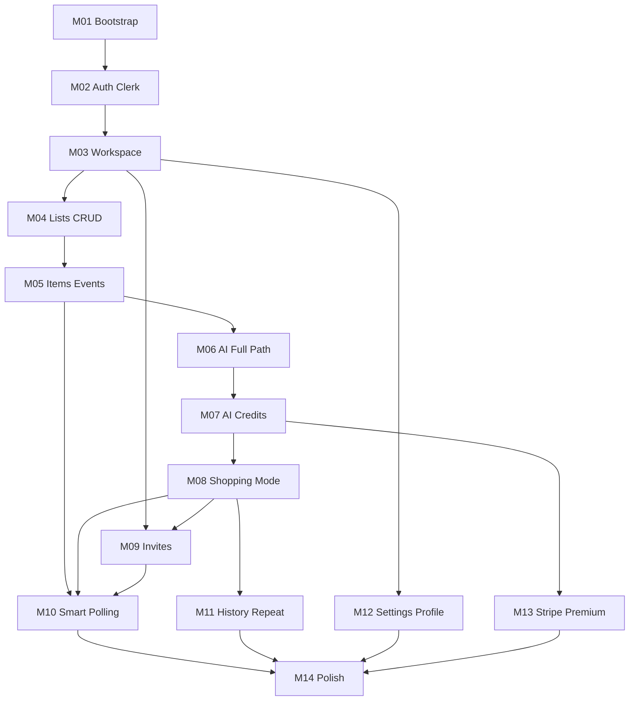

# Kangur — MVP Implementation Roadmap

**Status:** Living document — return here between milestones  
**Last updated:** 2026-07-16  
**Companions:** [prd.md](./prd.md) · [architecture.md](./architecture.md) · [cursor-rules.md](./cursor-rules.md)

---

## Locked defaults

| Decision | Value |
|----------|--------|
| Repo layout | `mobile/` + `backend/` + `docs/` — **no `packages/`** |
| Database | **Neon** (serverless Postgres) + Prisma — **no Prisma Accelerate** |
| Free AI Credits | **30 / month** per workspace |
| AI Credit costs | Screenshot **2** · Text/Clipboard **1** |
| Invites | Email |
| Auth | Clerk: **email/password**, **Google**, **Apple** |
| AI Review | Always shown (compact when all high-confidence) |
| OpenAPI | **Generated from Zod only** — never hand-edit |
| Env setup | Complete `.env.example` from M01 (fresh clone in minutes) |

### OpenAPI (non-negotiable)

Spec is generated automatically from Zod (e.g. `@asteasolutions/zod-to-openapi` + build/CI script). Routes register Zod schemas; clients may consume the generated file. If the spec drifts, fix the **Zod source** — not the OpenAPI document.

### Product-first order (why)

```
Workspace → CRUD → AI (Import→Processing→Review→Apply) → Shopping Mode → Invites → Polling → …
```

Screenshot → AI → list is the product. Invites and polling support collaboration but do not define the wedge. Shopping Mode ships right after AI so the demo already works end-to-end.



### Cursor habit

One vertical slice per milestone; register new Zod schemas so OpenAPI regenerates in the same change; no Redux/MobX; keep docs to: `prd.md`, `architecture.md`, `cursor-rules.md`, `roadmap.md`.

### Milestone status

| ID | Milestone | Status |
|----|-----------|--------|
| M01 | Bootstrap | pending |
| M02 | Auth (Clerk) | pending |
| M03 | Workspace | pending |
| M04 | Lists CRUD | pending |
| M05 | Items + events | pending |
| M06 | AI full path | pending |
| M07 | AI Credits | pending |
| M08 | Shopping Mode | pending |
| M09 | Invites | pending |
| M10 | Smart polling | pending |
| M11 | History + Repeat | pending |
| M12 | Settings + Profile | pending |
| M13 | Stripe Premium | pending |
| M14 | Polish + RC | pending |

---

## M01 — Bootstrap (repo, apps, design tokens, i18n shell)

**Goal:** Runnable empty Expo + Next.js + Prisma + **Neon** + CI skeleton with design-system tokens, PL/EN wiring, and **complete `.env.example` files** (no product features yet).

**Creates:**
- `backend/package.json`, `backend/tsconfig.json`, `backend/next.config.ts`, `backend/app/layout.tsx`, `backend/app/api/health/route.ts`
- `backend/prisma/schema.prisma` (minimal stub + `DIRECT_URL` support if using Neon pooler), `backend/lib/prisma.ts`
- `backend/openapi/registry.ts`, `backend/scripts/generate-openapi.ts` (or npm script), generated `backend/openapi/openapi.json` (**gitignored or marked GENERATED — never hand-edited**)
- **`backend/.env.example`** — full variable set from day one (Neon `DATABASE_URL` / `DIRECT_URL`, Clerk, OpenAI, Stripe, `AI_FREE_MONTHLY_CREDITS=30`, `APP_URL`, …)
- **`mobile/.env.example`** — `EXPO_PUBLIC_CLERK_PUBLISHABLE_KEY`, `EXPO_PUBLIC_API_URL`
- `mobile/package.json`, Expo Router `mobile/app/_layout.tsx`, `mobile/app/(tabs)/_layout.tsx` + placeholder tab screens
- `mobile/design-system/tokens.ts`, `mobile/design-system/theme.ts`
- `mobile/lib/i18n/index.ts`, `mobile/lib/i18n/pl.json`, `mobile/lib/i18n/en.json`
- `mobile/lib/api/client.ts` (base URL only), `mobile/lib/query/client.tsx`
- Root `README.md` (setup: Neon project → copy env → migrate → run), `.gitignore`, optional `.github/workflows/ci.yml` (include `openapi:generate` check)
- Document Neon branching: production / preview / local (README)

**Depends on:** nothing  
**Complexity:** M  

**Acceptance:**
- [ ] `backend` starts; `GET /api/health` returns 200
- [ ] Expo app launches with 4 placeholder tabs
- [ ] Tokens + i18n switch PL/EN works on a demo string
- [ ] Prisma migrates successfully against **Neon** (pooled + direct URL pattern documented)
- [ ] **No Prisma Accelerate** in dependencies
- [ ] `pnpm openapi:generate` (or equivalent) produces OpenAPI from Zod registry only
- [ ] `.env.example` files list every expected secret/public var (including future Clerk/Stripe/OpenAI) so setup is copy-fill-run
---

## M02 — Authentication (Clerk)

**Goal:** Sign up / sign in via **email/password**, **Google**, and **Apple**; authenticated API calls from mobile.

**Creates:**
- `backend/lib/auth/clerk.ts`, `backend/lib/auth/requireUser.ts`
- `backend/app/api/v1/me/route.ts`
- `backend/features/auth/*` (upsert helpers)
- `mobile/features/auth/sign-in-screen.tsx`, `mobile/app/(auth)/sign-in.tsx`
- Clerk providers in `mobile/app/_layout.tsx` (and backend middleware if used)
- Clerk Dashboard / Expo config for Apple Sign In (bundle IDs, capability) documented in `.env.example` / README
- Env keys in both `.env.example` files

**Depends on:** M01  
**Complexity:** M  

**Acceptance:**
- [ ] Email/password sign-up and sign-in work
- [ ] Google OAuth works on device/simulator
- [ ] Apple Sign In works on iOS (required path for App Store); Android/web behavior per Clerk/Apple constraints documented
- [ ] `GET /api/v1/me` rejects unauthenticated; returns Clerk-linked identity when valid
- [ ] Signed-out users cannot reach main tabs

---

## M03 — Workspace core (provision, avatar, switcher)

**Goal:** On first login, upsert `User` + default Home workspace; create/list/switch workspaces with emoji avatar.

**Creates (backend):**
- Prisma: `User`, `Workspace`, `WorkspaceMember`, `WorkspaceSettings`, `Subscription` (free stub), `AIUsage` (stub)
- `backend/features/workspace/createWorkspace.ts`, `listWorkspaces.ts`, `getWorkspace.ts`
- `backend/app/api/v1/workspaces/route.ts`, `backend/app/api/v1/workspaces/[workspaceId]/route.ts`
- `backend/lib/authorize.ts`
- Register workspace Zod schemas in OpenAPI registry (regenerate; do not hand-write paths)

**Creates (mobile):**
- `mobile/features/workspace/workspace-switcher.tsx`, `create-workspace-sheet.tsx`
- `mobile/features/workspace/api.ts`, TanStack Query hooks
- Workspace tab wired to real data

**Depends on:** M02  
**Complexity:** M  

**Acceptance:**
- [ ] First login creates user + default workspace (avatar e.g. house emoji)
- [ ] Create second workspace with custom avatar; switcher updates active context
- [ ] All workspace routes enforce membership

---

## M04 — Shopping lists CRUD

**Goal:** Create/rename/list active lists in a workspace; open list screen (empty items OK).

**Creates:**
- Prisma: `ShoppingList`
- `backend/features/shopping-list/*` + `/api/v1/workspaces/:id/lists` CRUD
- `mobile/features/shopping-list/home-lists-screen.tsx`, `list-screen.tsx` (shell)
- Home tab wired to active lists + create CTA

**Depends on:** M03  
**Complexity:** S–M  

**Acceptance:**
- [ ] CRUD active lists scoped to workspace
- [ ] Cross-workspace list IDs return 404/403
- [ ] Home shows lists for active workspace only

---

## M05 — Shopping items CRUD + activity log writes

**Goal:** Manual add/edit/status; closed category enum; append `ShoppingEvent` on mutations (no polling yet). Baseline list so AI has something to merge into.

**Creates:**
- Prisma: `ShoppingItem`, `ShoppingEvent`
- Zod: category enum, item DTOs
- `backend/features/shopping-item/*`, `backend/lib/events/appendShoppingEvent.ts`
- Routes under `/api/v1/lists/:listId/items`
- `mobile/features/shopping-item/manual-add-sheet.tsx`, item row (normal density)
- Register item/event Zod schemas → regenerate OpenAPI
- `GET .../events?after=` ready for later polling

**Depends on:** M04  
**Complexity:** M  

**Acceptance:**
- [ ] Add/edit item; statuses pending/bought/unavailable/removed
- [ ] Category only from closed enum
- [ ] Each mutation creates a `ShoppingEvent` row
- [ ] Events endpoint returns cursor-friendly results

---

## M06 — AI feature (Import → Processing → Review → Apply)

**Goal:** Ship the **entire killer path as one feature**. Solo user can go: import → AI → ready list.

**Flow:**

```
Import (Screenshot | Text | Clipboard)
  → Processing
  → AI Review
  → Apply
  → List updated
```

**AI Review actions (required):**
- **Accept all** — primary CTA when safe
- **Accept individual** — per proposed item / merge
- **Reject individual** — drop one proposal row without leaving Review
- **Edit** — rename, qty, unit, category, note
- Reject-all / cancel abandon without apply (list unchanged)

**Creates (backend):**
- Prisma: `AiIngestRun`
- `backend/features/ai/schemas.ts` (Zod structured outputs)
- `backend/features/ai/ingestText.ts`, `ingestScreenshot.ts`, `applyAiProposal.ts`
- Routes: `POST .../ai/ingest`, `POST .../ai/apply`
- `backend/lib/openai.ts`
- Ephemeral screenshot handling (no durable storage)
- Register ingest/apply Zod → regenerate OpenAPI

**Creates (mobile):**
- `mobile/features/ai/import-chooser-screen.tsx`
- `mobile/features/ai/import-text-screen.tsx`, `import-screenshot-screen.tsx`, `clipboard-offer.tsx`
- `mobile/features/ai/processing-screen.tsx`
- `mobile/features/ai/ai-review-screen.tsx` (bulk + per-item accept/reject)
- Stack wiring from list → import → processing → review → back to list

**Depends on:** M05  
**Complexity:** L (2–3 Cursor sessions OK; still one milestone)

**Acceptance:**
- [ ] Screenshot, text, and clipboard entry points work
- [ ] Clipboard offer when returning with text (Android priority)
- [ ] Ingest returns structured proposal only (never free-text parse)
- [ ] Categories from closed enum; no invented quantities/brands in schema rules
- [ ] Review shows low confidence, merges, unknown items
- [ ] Accept all, accept individual, reject individual, and edit all work
- [ ] Apply writes only accepted rows + events + raw JSONB; abandon before apply leaves list unchanged
- [ ] Screenshots not persisted after the request

---

## M07 — AI Credits metering

**Goal:** Server-enforced AI Credits; Free cap; balance visible in UI.

**Cost table (MVP):**

| Action | AI Credits |
|--------|------------|
| Text import | 1 |
| Clipboard import | 1 |
| Screenshot import | 2 |

**Creates:**
- `backend/lib/aiCredits.ts` (`debitAiCredits`, period bucket, cost map above)
- Wire debit into successful **apply** (not failed validation / abandoned review)
- `GET .../ai-credits`
- `mobile/features/billing/ai-credits-badge.tsx` on Workspace tab
- Env `AI_FREE_MONTHLY_CREDITS=30`

**Depends on:** M06  
**Complexity:** S–M  

**Acceptance:**
- [ ] Screenshot apply debits **2**; text/clipboard apply debits **1**
- [ ] Exhausted Free balance blocks ingest; list CRUD still works
- [ ] Product copy says “AI Credits”

---

## M08 — Shopping Mode + Finish Shopping + Summary

**Goal:** In-store UX + trip ending. Hard to leave by accident; easy to add one more item without exiting.

**Creates:**
- `mobile/features/shopping-list/shopping-mode-screen.tsx`
- `mobile/features/shopping-list/finish-summary-screen.tsx`
- `mobile/features/shopping-list/shopping-mode-exit-guard.ts` (back gesture / hardware back)
- `mobile/design-system/shopping-density.ts`
- Expo keep-awake integration
- **Floating Add Button** → manual add sheet without leaving Shopping Mode
- Backend archive / finish helpers as needed
- Swipe / huge checkboxes; Finish → counts → Archive

**Shopping Mode UX rules:**
- **Disable accidental back gesture** (iOS swipe-back / Android back) — or intercept it
- **Confirm exit** before leaving Shopping Mode (unless Finish Shopping flow)
- **Floating Add Button** — mid-shop add without exiting mode

**Depends on:** M05; best after M06 so demo is Import → Review → Shopping Mode  
**Complexity:** M  

**Acceptance:**
- [ ] Start shopping enters Shopping Mode (large targets, minimal chrome)
- [ ] Accidental back does not silently exit; user gets confirm exit
- [ ] Floating Add Button opens manual add and returns to Shopping Mode
- [ ] Optional keep-screen-on (default off until settings; hardcode toggle OK)
- [ ] Finish shows Bought / Unavailable / Removed counts
- [ ] Archive from summary removes list from Home active set

---

## M09 — Members and email invitations

**Goal:** Multi-user workspace — after the product wedge exists.

**Creates:**
- Prisma: `Invitation`
- `backend/features/workspace/inviteMember.ts`, `acceptInvitation.ts`, `listMembers.ts`
- Routes: members, invitations, accept
- `mobile/features/workspace/invite-screen.tsx`, `members-list.tsx`
- Stack route Invite Members

**Depends on:** M03; useful after M08 for two-person shopping demos  
**Complexity:** M  

**Acceptance:**
- [ ] Owner/admin can invite by email; member cannot
- [ ] Invitee accepts and sees workspace
- [ ] Unauthorized role actions return 403

---

## M10 — Smart polling (`RealtimeProvider`)

**Goal:** Live collaboration once invites exist; transport-agnostic.

**Creates:**
- `mobile/lib/realtime/RealtimeProvider.ts` (interface)
- `mobile/lib/realtime/PollingProvider.ts` (3s; list/Shopping Mode focus only; AppState stop)
- Soft toast on remote events
- Optional sound/haptic stubs
- Query cache patch/invalidate from `events?after=`

**Depends on:** M05 (events API), M09 (second user); Shopping Mode lifecycle from M08  
**Complexity:** M  

**Acceptance:**
- [ ] Two members: A mutates, B updates within ~3s without pull-to-refresh
- [ ] Polling stops on background / leave list
- [ ] No websocket vendor in domain code

---

## M11 — History + search + Repeat List

**Goal:** Past lists, search, duplicate as new pending list.

**Creates:**
- History tab UI + search
- `backend/features/shopping-list/repeatList.ts`, `searchLists.ts`
- Routes: repeat, restore
- Free history depth guard (e.g. last 20 lists)

**Depends on:** M08 (archive path)  
**Complexity:** S–M  

**Acceptance:**
- [ ] History shows archived/past; search by title/date
- [ ] Repeat List creates new list with items reset to pending
- [ ] Restore works
- [ ] Free depth limit enforced

---

## M12 — Workspace settings + Profile

**Goal:** Settings that affect shopping/sync; profile locale / sign out.

**Creates:**
- Settings per PRD (language, notifications, sound, vibration, default shopping layout, keep screen on, AI prefs)
- `mobile/features/settings/*`, Profile tab
- API patch workspace settings + user locale

**Depends on:** M03; enhances M08/M10  
**Complexity:** S–M  

**Acceptance:**
- [ ] Settings persist; affect keep-awake + toast sound/haptic
- [ ] Profile switches PL/EN
- [ ] No settings beyond PRD list

---

## M13 — Stripe Premium

**Goal:** Workspace subscription; unlimited AI Credits when active.

**Creates:**
- `backend/features/billing/*` Checkout + Customer Portal + webhook
- `mobile/features/billing/premium-screen.tsx`
- Subscription status bypasses Free AI Credit cap
- Register billing Zod schemas → regenerate OpenAPI

**Depends on:** M07, M03  
**Complexity:** M–L  

**Acceptance:**
- [ ] Owner/admin Checkout; webhook upgrades workspace
- [ ] Premium skips Free AI Credit cap
- [ ] Member cannot manage billing
- [ ] Webhook signature verified

---

## M14 — Polish + release candidate

**Goal:** Design-system consistency, motion, dark mode, mascot empty states, a11y, EAS smoke build.

**Creates/updates:**
- Token/dark mode pass
- 2–3 motions (enter, status, toast)
- Empty states (kangaroo / warm orange)
- Category labels PL/EN complete
- `mobile/eas.json`
- Final sweep against PRD MVP acceptance

**Depends on:** M06–M13 substantially complete  
**Complexity:** M  

**Acceptance:**
- [ ] PL/EN parity on user-facing strings
- [ ] Dark mode via tokens
- [ ] Shopping Mode one-handed verified
- [ ] PRD MVP checklist mostly green
- [ ] Dev/preview EAS build succeeds

---

## Suggested Cursor session sizing

| Milestone | Typical sessions |
|-----------|------------------|
| M01–M05 | 1–2 each |
| M06 AI (full path) | 2–3 (one feature, multiple sessions OK) |
| M07–M12 | 1 each |
| M13 | 1–2 |
| M14 | 1–2 |

---

## Explicitly out of this roadmap

Voice, AI suggestions, AI cleanup on Repeat, websocket vendors, UploadThing, Redux/MobX, `packages/` monorepo, web/admin apps, additional docs beyond the four listed above.

---

## How to use this document

1. Before each milestone: re-read this file + relevant PRD/architecture sections.
2. Implement **one milestone at a time**, starting with **M01**.
3. After a milestone ships: tick acceptance criteria and set its status to `done` in the table above.
4. Detailed implementation plans for a single milestone (e.g. M01) may live in chat/Cursor plans — this file remains the source of truth for order and scope.
